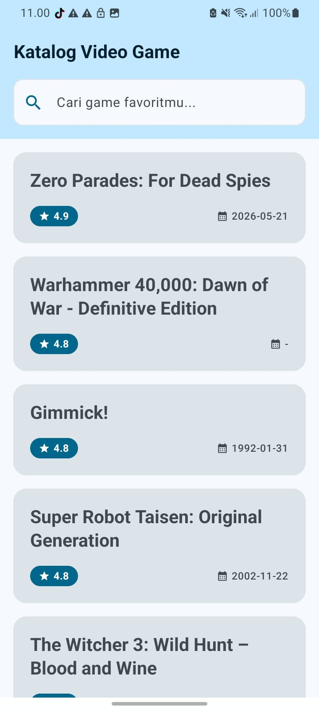
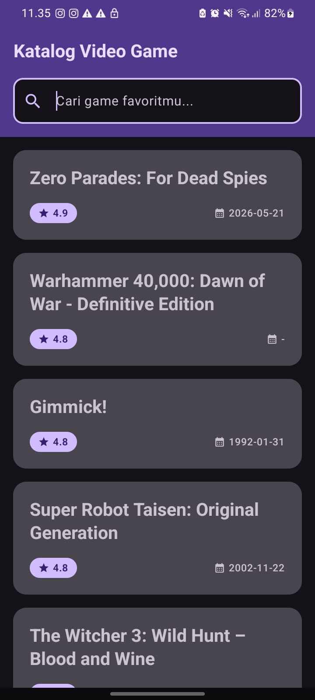
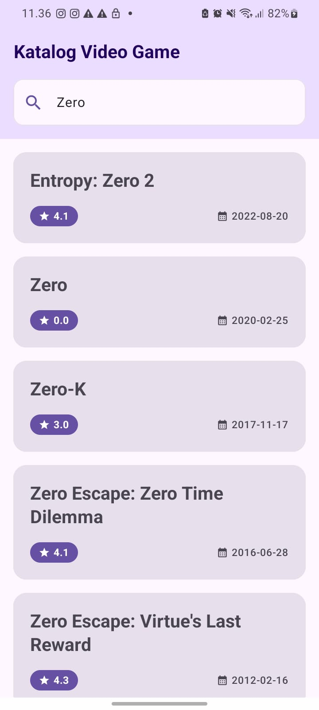
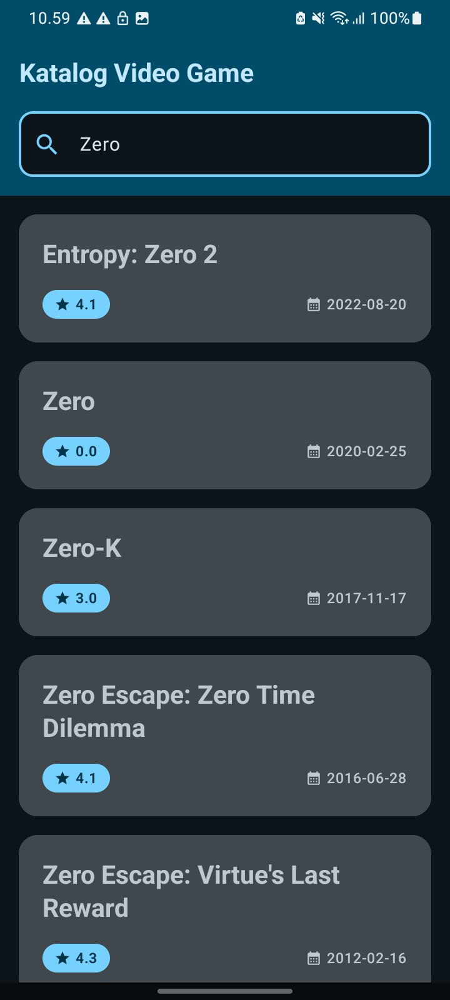
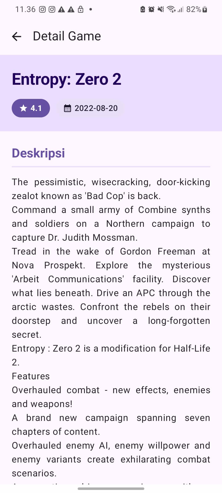
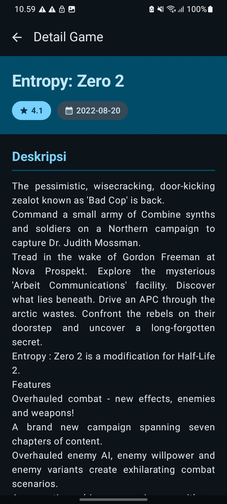

# 🎮 GameCatalog

Aplikasi mobile katalog video game berbasis Android yang mengambil data secara dinamis dari REST API [RAWG](https://rawg.io/apidocs). Pengguna dapat menelusuri daftar game populer, mencari game berdasarkan nama, serta melihat detail lengkap setiap game.

---

## 🎥 Demo Aplikasi


## 📸 Screenshots

### Home Screen
| Light Mode | Dark Mode |
|:---:|:---:|
|  |  |

### Search
| Light Mode | Dark Mode |
|:---:|:---:|
|  |  |

### Game Detail Screen
| Light Mode | Dark Mode |
|:---:|:---:|
|  |  |

---

## 🛠️ Penjelasan Teknis

### 1. Bahasa Pemrograman — Kotlin

Seluruh kode ditulis dalam **Kotlin** dengan memanfaatkan fitur-fitur utama bahasa:

- **`data class`**: digunakan untuk model data seperti `Game`, `GameDetail`, `GameResponse`, `HomeUiState`, dan `GameDetailUiState`. Data class secara otomatis menghasilkan `equals()`, `hashCode()`, dan `copy()`.
- **Null safety**: field opsional seperti `released: String?` dan `description: String?` menggunakan tipe nullable, dan diakses dengan safe call operator `?.` serta Elvis operator `?:`.
- **Lambda**: digunakan untuk callback navigasi seperti `onGameClick: (Int) -> Unit` dan `onClick: () -> Unit`.

---

### 2. User Interface — Jetpack Compose & Material Design 3

UI dibangun sepenuhnya menggunakan **Jetpack Compose** tanpa XML layout:

- **Composable layout**: `Scaffold`, `TopAppBar`, `Column`, `Row`, `Card`, `LazyColumn`, `OutlinedTextField`, `CircularProgressIndicator`, `IconButton`
- **Material Design 3**: seluruh komponen UI berasal dari library `androidx.compose.material3`
- **Theme**: `GameCatalogTheme` di `Theme.kt` menerapkan color scheme (light/dark/dynamic) dan `Typography` ke seluruh aplikasi melalui `MaterialTheme`

---

### 3. List dan Data — `LazyColumn`

Daftar game di Home Screen ditampilkan menggunakan **`LazyColumn`**, yaitu komponen lazy layout yang hanya me-render item yang terlihat di layar (efisien untuk daftar panjang. Setiap item dirender sebagai `GameCard` berisi nama dan rating game.

---

### 4. State dan Recomposition

Aplikasi menerapkan **state-driven UI** menggunakan `StateFlow`:

- State disimpan sebagai `data class` (`HomeUiState`, `GameDetailUiState`) di dalam ViewModel
- UI subscribe ke state menggunakan `collectAsStateWithLifecycle()`, sehingga recomposition terpicu otomatis setiap ada perubahan state
- **Search functionality** menggunakan debounce 500ms (`delay(500)`) agar API tidak dipanggil setiap huruf yang diketik — request sebelumnya dibatalkan menggunakan `Job.cancel()`

---

### 5. Networking — RAWG API via Retrofit

Data game diambil dari **RAWG REST API** menggunakan **Retrofit**:

- **Base URL**: `https://api.rawg.io/api/`
- **API Key**: disimpan di `local.properties` sebagai `RAWG_API_KEY` dan diakses melalui `BuildConfig.RAWG_API_KEY` (tidak di-hardcode di kode sumber)
- **Endpoints**:
  - `GET /games` — mengambil daftar game (dengan parameter `search`, `search_precise`, `ordering`, `page_size`)
  - `GET /games/{id}` — mengambil detail satu game
- **Data yang diambil**:
  - `name` — nama game
  - `rating` — rating berupa angka desimal
  - `released` — tanggal rilis format ISO 8601 (`YYYY-MM-DD`)
  - `description` — deskripsi lengkap game (hanya di endpoint detail)
- **Konversi JSON**: menggunakan `GsonConverterFactory`
- **Logika search**: saat query tidak kosong, parameter `search_precise=true` dikirim agar pencarian hanya mencocokkan nama game, dan `ordering` dihilangkan agar RAWG mengurutkan hasil berdasarkan relevansi

---

### 6. Arsitektur — MVVM

Aplikasi menerapkan pola arsitektur **MVVM (Model-View-ViewModel)** dengan pemisahan layer yang jelas:

```
UI Layer (View)
    HomeScreen.kt
    GameDetailScreen.kt
         │
         ▼
ViewModel Layer
    HomeViewModel.kt
    GameDetailViewModel.kt
         │
         ▼
Repository Layer
    GameRepository.kt
         │
         ▼
Remote Data Layer
    RawgApiService.kt  (Retrofit Interface)
         │
         ▼
    RAWG REST API
```

- **ViewModel** — mengelola state UI dan memanggil repository. Tidak bergantung pada Android framework View sehingga tidak terpengaruh lifecycle Activity/Fragment.
- **Repository** — menjadi single source of truth dan abstraksi antara ViewModel dengan sumber data. Berisi logika parameter API (search_precise, ordering).
- **RawgApiService** — interface Retrofit yang mendefinisikan endpoint API menggunakan annotation `@GET`, `@Query`, dan `@Path`.

---

### 7. Screens & Navigasi

Aplikasi memiliki dua screen yang dihubungkan menggunakan **Jetpack Navigation Compose**:

#### Home Screen (`HomeScreen.kt`)
- Menampilkan `TopAppBar` dengan judul "Katalog Video Game"
- Search bar (`OutlinedTextField`) yang mengaktifkan debounced search
- `LazyColumn` berisi `GameCard` — setiap card menampilkan **nama** dan **rating** game
- State handling: loading indicator, pesan error, dan pesan "game tidak ditemukan"

#### Game Detail Screen (`GameDetailScreen.kt`)
- Menampilkan **nama**, **rating**, **tanggal rilis**, dan **deskripsi** game yang dipilih
- Deskripsi dibersihkan dari tag HTML menggunakan fungsi `cleanHtmlDescription()`
- Tombol back di `TopAppBar` untuk kembali ke Home Screen
- Konten dapat di-scroll menggunakan `verticalScroll`

#### Navigasi (`GameCatalogApp.kt`)
- Menggunakan `NavHost` + `composable()` dari Navigation Compose
- Route `"home"` → Home Screen
- Route `"detail/{gameId}"` → Game Detail Screen dengan argument `gameId: Int`
